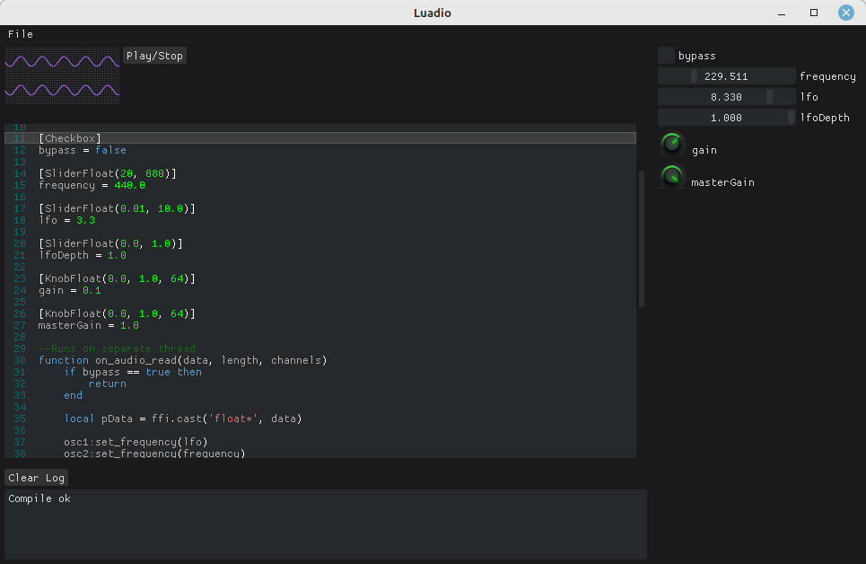

# Luadio

This application lets you generate audio on the fly using Lua.

# Building
- `git clone https://github.com/japajoe/luadio`
- `cd luadio`
- `git submodule update --init --recursive`
- `mkdir build`
- `cd build`
- `cmake ..`
- `cmake --build .`
